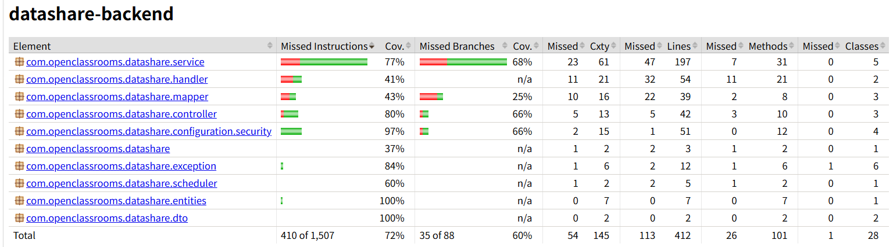
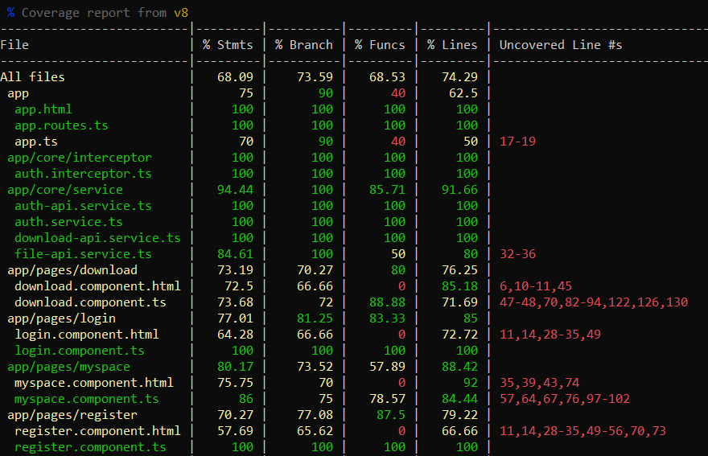
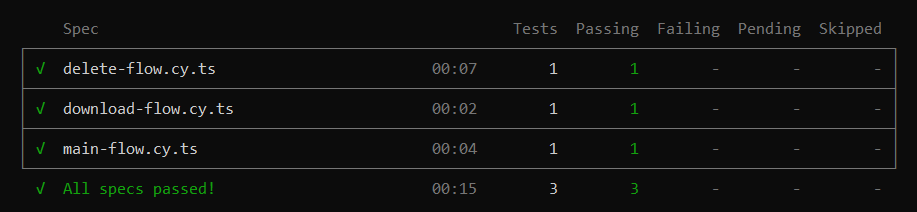

# TESTING

## Plan de tests

| Partie | Type de test | Vérifications |
|---|---|---|
| Backend | Unitaires et intégration | authentification, upload, téléchargement, suppression, expiration |
| Frontend | Unitaires | services, formulaires, affichage et gestion des erreurs |
| Application complète | E2E Cypress | inscription/connexion/upload, téléchargement, suppression |

## Critères d'acceptation

- tous les tests doivent réussir ;
- les 3 scénarios E2E critiques doivent fonctionner ;
- la couverture des lignes doit atteindre au moins 70 % sur le backend et le frontend.

## Backend

- 46 tests
- 46 succès
- tests unitaires et tests d'intégration avec PostgreSQL/Testcontainers
- couverture des lignes : 72,57 %

Commande :

```powershell
cd backend
.\mvnw.cmd test
```

## Frontend

- 92 tests
- 92 succès
- tests des services, composants et affichage
- couverture des lignes : 74,29 %

Commande :

```powershell
cd frontend
npm test -- --watch=false --coverage
```

## Tests E2E

3 scénarios Cypress :

- inscription → connexion → upload → lien
- upload anonyme → téléchargement
- upload → consultation → suppression

Résultat : 3 succès, 0 échec.

Commande utilisée (sur ARM) :

    C:\Tools\node-x64\node-v24.19.0-win-x64\node.exe .\node_modules\cypress\bin\cypress run

## Couverture

Objectif OpenClassrooms : 70 %.

- backend : 72,57 %
- frontend : 74,29 %

L'objectif est atteint.

## Preuves

### Couverture backend



### Couverture frontend



### Tests E2E

