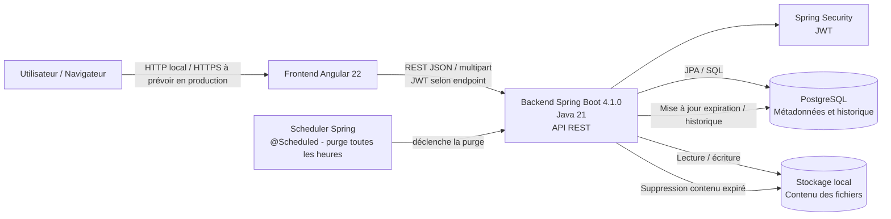

# DataShare - Schéma d'architecture

## Principes

- Angular communique uniquement avec l'API REST Spring Boot.
- PostgreSQL stocke les comptes, métadonnées et traces historiques nécessaires.
- Le contenu binaire des fichiers est stocké dans le système de fichiers local.
- JWT protège les endpoints nécessitant un utilisateur connecté.
- `POST /api/files` accepte soit un JWT valide (upload connecté), soit aucun JWT
  (upload anonyme). Un JWT fourni mais invalide est refusé.
- Le scheduler Spring effectue un premier contrôle 5 secondes après le démarrage, puis contrôle les fichiers expirés toutes les heures.
- Après expiration, le contenu physique est supprimé et seules les informations minimales
  nécessaires à l'historique et au message « lien expiré » sont conservées.

## Organisation du frontend

Le frontend Angular est organisé en trois ensembles principaux :

- `pages/` : composants correspondant aux écrans de l'application (`login`, `register`, `upload`, `download`, `myspace`) ;
- `core/` : services, modèles et interceptor utilisés par plusieurs pages ;
- `shared/` : composants réutilisables, notamment le header.

Les composants des pages gèrent l'affichage et les interactions utilisateur.
Les services centralisent les appels HTTP vers l'API.
L'interceptor ajoute le JWT aux requêtes protégées.

## Organisation du backend

Le backend Spring Boot est organisé en couches séparées :

- `controller/` : reçoit les requêtes HTTP et retourne les réponses ;
- `service/` : contient la logique métier ;
- `repository/` : accède aux données PostgreSQL avec Spring Data JPA ;
- `entities/` : représente les données persistées ;
- `dto/` : définit les données échangées avec l'API ;
- `configuration/security/` : gère l'authentification et les JWT ;
- `handler/` et `exception/` : centralisent la gestion des erreurs ;
- `scheduler/` : déclenche la purge automatique des fichiers expirés.

Cette séparation permet de distinguer les responsabilités et de faciliter les tests et la maintenance.
