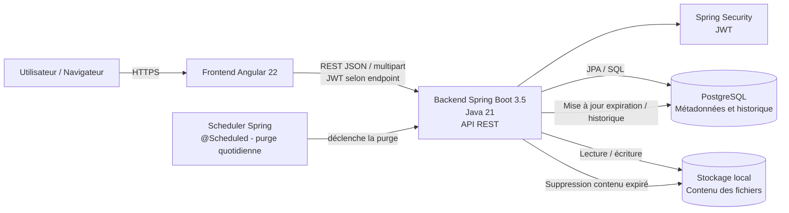

# DataShare - Schéma d'architecture

## Principes

- Angular communique uniquement avec l'API REST Spring Boot.
- PostgreSQL stocke les comptes, métadonnées et traces historiques nécessaires.
- Le contenu binaire des fichiers est stocké dans le système de fichiers local.
- JWT protège les endpoints nécessitant un utilisateur connecté.
- `POST /api/files` accepte soit un JWT valide (upload connecté), soit aucun JWT
  (upload anonyme). Un JWT fourni mais invalide est refusé.
- Le scheduler Spring lance la purge quotidienne des contenus expirés.
- Après expiration, le contenu physique est supprimé et seules les informations minimales
  nécessaires à l'historique et au message « lien expiré » sont conservées.
