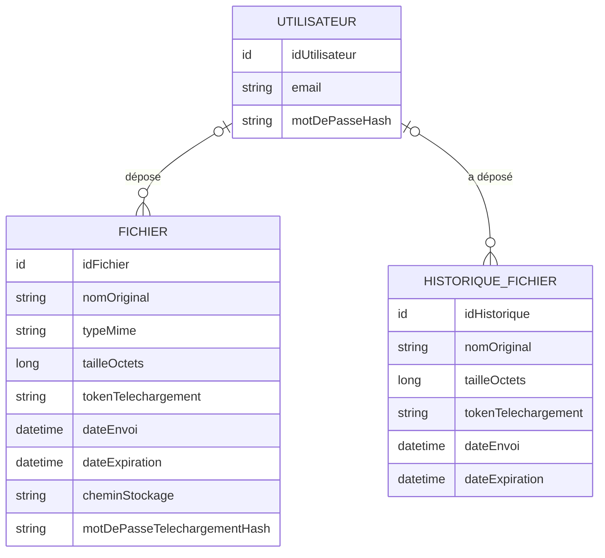

# DataShare - Modèle Conceptuel de Données

## MCD

## Cardinalités
- Un UTILISATEUR peut déposer zéro à plusieurs FICHIERS.
- Un FICHIER est lié à zéro ou un UTILISATEUR :
- un fichier envoyé par un utilisateur connecté possède un propriétaire ;
- un fichier envoyé anonymement n'est lié à aucun utilisateur.
- Un UTILISATEUR peut avoir zéro à plusieurs entrées dans HISTORIQUE_FICHIER.
- Une entrée HISTORIQUE_FICHIER est liée à zéro ou un UTILISATEUR :
  - un fichier expiré appartenant à un utilisateur connecté conserve le lien avec son propriétaire ;
  - un fichier envoyé anonymement peut également laisser une trace historique sans propriétaire afin de reconnaître son ancien token.

## Contraintes principales
- L'email utilisateur est unique.
- Le mot de passe utilisateur est stocké sous forme hashée et salée.
- Le token de téléchargement est unique et non prédictible.
- Un token correspond à un seul fichier actif ou à une seule trace historique.
- Le mot de passe de téléchargement est facultatif et stocké sous forme hashée.
- La taille maximale d'un fichier est de 1 Go.
- La durée d'expiration est comprise entre 1 et 7 jours, avec 7 jours par défaut.

## Gestion de l'expiration

Les spécifications demandent à la fois :

- la suppression du fichier et de ses métadonnées à expiration ;
- l'affichage des fichiers expirés dans l'historique utilisateur ;
- une erreur explicite lorsqu'un destinataire utilise un lien expiré.

Décision de conception :

- tant que le fichier est valide, ses métadonnées sont stockées dans FICHIER et son contenu physique dans le stockage local ;
- à expiration, une trace minimale est créée dans HISTORIQUE_FICHIER ;
cette trace conserve uniquement :
  - l'identifiant de l'historique ;
  - le propriétaire éventuel ;
  - le nom original ;
  - la taille ;
  - le token de téléchargement ;
  - la date d'envoi ;
  - la date d'expiration ;
- le fichier physique est ensuite supprimé ;
- l'enregistrement FICHIER et ses métadonnées techniques sont supprimés ;
- le chemin de stockage, le type MIME et le hash du mot de passe de téléchargement ne sont pas conservés dans l'historique ;
- le token conservé permet de distinguer :
  - un lien valide ;
  - un lien expiré ;
  - un token inconnu ;
- une entrée présente dans HISTORIQUE_FICHIER est par définition expirée : il n'est donc pas nécessaire de stocker un statut EXPIRED ;
- une suppression manuelle par le propriétaire supprime le fichier physique et ses métadonnées sans créer de trace historique, conformément à US06.
