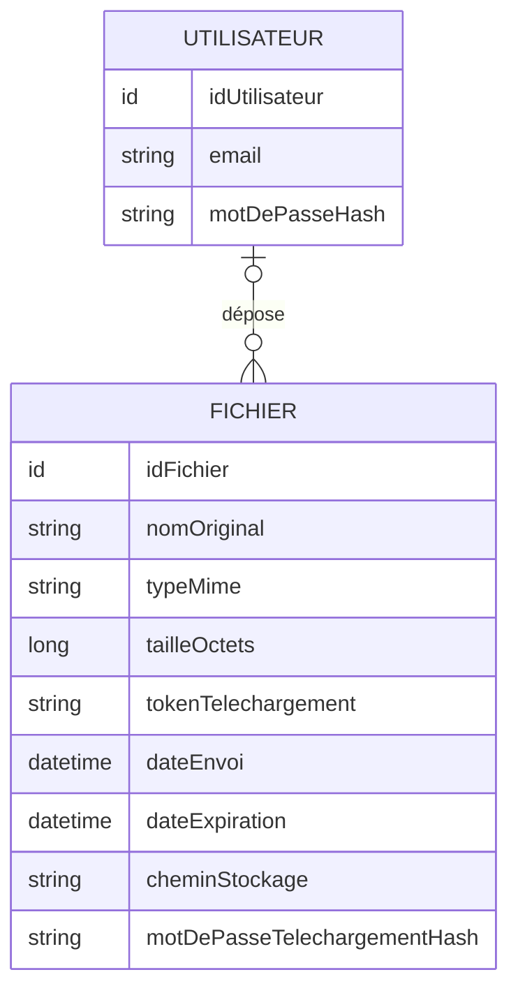

# DataShare - Modèle Conceptuel de Données

## MCD

## Cardinalités

- Un UTILISATEUR peut déposer zéro à plusieurs FICHIERS.
- Un FICHIER est lié à zéro ou un UTILISATEUR :
  - un fichier envoyé par un utilisateur connecté possède un propriétaire ;
  - un fichier envoyé anonymement n'est lié à aucun utilisateur.

## Contraintes principales

- L'email utilisateur est unique.
- Le mot de passe utilisateur est stocké sous forme hashée et salée.
- Le token de téléchargement est unique et non prédictible.
- Le mot de passe de téléchargement est facultatif et stocké sous forme hashée.
- La taille maximale d'un fichier est de 1 Go.
- La durée d'expiration est comprise entre 1 et 7 jours, avec 7 jours par défaut.

## Gestion de l'expiration

Les spécifications demandent à la fois la suppression des données associées à expiration
et l'affichage des fichiers expirés dans l'historique utilisateur. La maquette Figma
prévoit également un filtre « Expiré ».

Décision de conception :
- à expiration, le contenu physique du fichier est supprimé ;
- le chemin de stockage et le hash du mot de passe de téléchargement sont supprimés ;
- une trace historique minimale reste conservée en base : identifiant, propriétaire éventuel,
  nom, type, taille, token, date d'envoi et date d'expiration ;
- le token conservé permet de distinguer un lien expiré d'un token inexistant et de retourner
  une erreur explicite au destinataire ;
- le statut VALID / EXPIRED est calculé à partir de la date d'expiration et n'est pas stocké ;
- une suppression manuelle par le propriétaire supprime le fichier physique et toutes ses
  métadonnées, conformément à US06.
